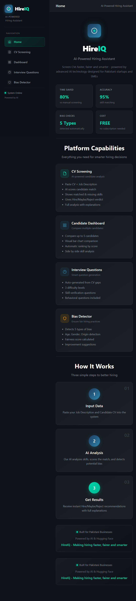
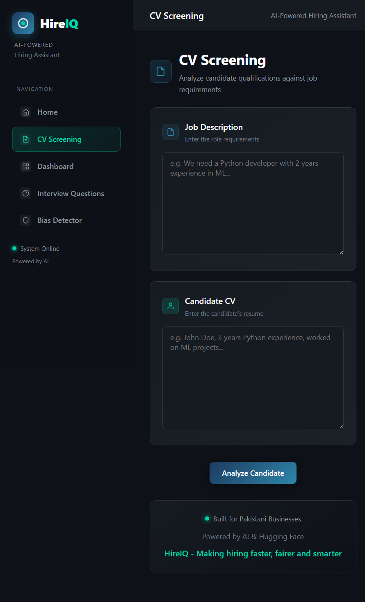
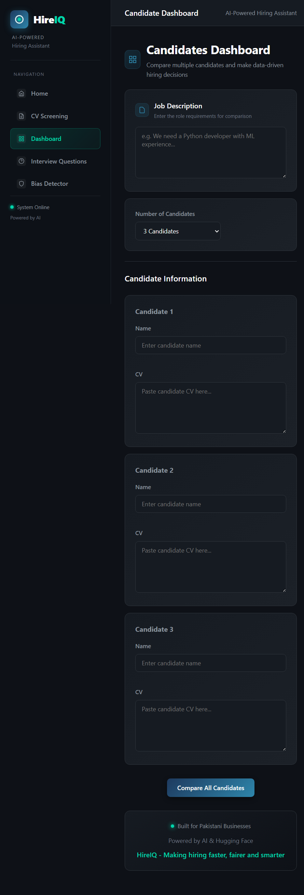
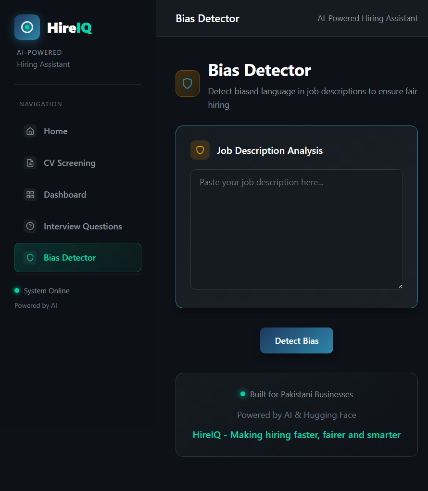

# HireIQ - AI-Powered Hiring Assistant

<p align="center">
  
  
  
  
  
  
  
</p>

> **HireIQ** is a free AI-powered hiring assistant built specifically
> for Pakistani startups and SMEs — making CV screening faster,
> fairer and smarter.

---

## The Problem

Every Pakistani startup and SME faces the same hiring nightmare:

| Problem | Reality |
|---|---|
| Manual CV screening | Hours wasted on each position |
| Unconscious bias | Good candidates rejected unfairly |
| No scoring system | Subjective, inconsistent decisions |
| Expensive agencies | Budgets drained on recruitment fees |

**HireIQ solves all of this — for free.**

---

## Demo

> Screenshots of the application in action

### Home Page


### CV Screening


### Candidate Dashboard


### Bias Detector


---

## Features

### CV Screening
- Paste any CV and job description
- AI calculates match score using TF-IDF algorithm
- Identifies exactly which skills match and which are missing
- Gives clear **Hire / Maybe / Reject** verdict
- Full AI-powered explanation of the decision

### Candidate Dashboard
- Compare up to 5 candidates simultaneously
- Visual bar chart with color-coded results
- Automatic ranking by match score
- Instant top candidate recommendation

### Interview Questions Generator
- Questions auto-generated from candidate skill gaps
- 3 difficulty levels: Easy, Medium, Hard
- Skill verification and behavioral questions included
- Customizable question count

### Bias Detector
- Scans job descriptions for 5 types of bias:
  - Age Bias
  - Gender Bias
  - Origin Bias
  - Appearance Bias
  - Exclusionary Language
- Calculates fairness score
- Provides specific improvement suggestions

---

## How It Works

```
┌─────────────────────────────────────────────────────────────────────────────┐
│  Step 1          Step 2                    Step 3                          │
│  ────────        ──────────────────        ──────────────────              │
│  Paste your  →   HireIQ analyzes      →   Get instant results              │
│  Job Desc        skills, scores            Hire / Maybe / Reject           │
│  and CV          the match and             with full explanation           │
│                  detects bias                                                │
└─────────────────────────────────────────────────────────────────────────────┘
```

---

## Tech Stack

### Frontend

| Technology | Purpose |
|---|---|
| React 18 | UI Framework |
| React Router | Page navigation |
| Axios | API calls |
| Recharts | Interactive charts |
| Custom CSS | Dark professional theme |

### Backend

| Technology | Purpose |
|---|---|
| FastAPI | High-performance REST API |
| Python 3.11 | Core language |
| Hugging Face API | AI text analysis (BART model) |
| Scikit-learn | TF-IDF + cosine similarity scoring |
| Pandas | Data manipulation |
| python-dotenv | Secure environment variables |

### Architecture

```
┌──────────────────────────────────────────────────────┐
│                    FRONTEND                           │
│         React 18 + Recharts + Custom CSS             │
│              http://localhost:3000                   │
└────────────────────────┬─────────────────────────────┘
                         │ HTTP/REST (Axios)
┌────────────────────────▼─────────────────────────────┐
│                    BACKEND                            │
│              http://localhost:8000                   │
│                                                      │
│  POST /api/screen-cv          → CV matching          │
│  POST /api/compare-candidates → Candidate ranking    │
│  POST /api/generate-questions → Question generation  │
│  POST /api/detect-bias        → Bias analysis        │
└──────────────────────────────────────────────────────┘
```

---

## Quick Start

### Prerequisites
- Python 3.11+
- Node.js 18+
- HuggingFace API Token (free)

### Option 1 — One Click Start (Windows)

```bash
git clone https://github.com/vishalhirani978/-HireIQ
cd HireIQ
run.bat
```

This starts both backend and frontend automatically!

### Option 2 — Manual Setup

**Backend:**
```bash
cd backend
pip install -r requirements.txt
uvicorn main:app --reload --port 8000
```

**Frontend:**
```bash
cd frontend
npm install
npm start
```

**Environment Variables:**

Create `.env` in root directory:
```
HUGGINGFACE_TOKEN=your_token_here
```

Get your free token: https://huggingface.co/settings/tokens

---

## API Reference

### POST /api/screen-cv

```json
Request:
{
  "job_desc": "Python developer with ML experience...",
  "cv_text": "Ahmed Khan, Python developer, 3 years..."
}

Response:
{
  "percentage": 65.4,
  "matched_skills": ["Python", "Machine Learning", "Pandas"],
  "missing_skills": ["TensorFlow", "Deep Learning"],
  "recommendation": "MAYBE - 65.4% Match...",
  "ai_analysis": "Candidate partially meets requirements..."
}
```

### POST /api/compare-candidates

```json
Request:
{
  "job_desc": "Senior Python Developer...",
  "candidates": [
    {"name": "Ahmed Khan", "cv": "..."},
    {"name": "Sara Ali", "cv": "..."}
  ]
}
```

### POST /api/generate-questions

```json
Request:
{
  "job_desc": "Python Developer role...",
  "cv_text": "Ahmed Khan CV...",
  "difficulty": "Medium",
  "num_questions": 5
}
```

### POST /api/detect-bias

```json
Request:
{
  "job_desc": "Looking for young energetic developer..."
}

Response:
{
  "fairness_score": 0,
  "biased_count": 5,
  "found_biases": {
    "Age Bias": ["young", "energetic", "under 30"],
    "Gender Bias": ["he must"]
  }
}
```

---

## Project Structure

```
HireIQ/
├── backend/
│   ├── main.py                  # FastAPI entry point
│   ├── routers/                 # API route handlers
│   │   ├── cv_screening.py
│   │   ├── dashboard.py
│   │   ├── interview.py
│   │   └── bias_detector.py
│   ├── services/                # Core business logic
│   │   ├── scorer.py            # TF-IDF scoring
│   │   ├── bias_checker.py      # Bias detection
│   │   └── question_gen.py      # Question generation
│   ├── models/                  # Pydantic schemas
│   └── requirements.txt
├── frontend/
│   ├── src/
│   │   ├── components/          # Reusable UI components
│   │   ├── pages/               # Page components
│   │   │   ├── Home.jsx
│   │   │   ├── CVScreening.jsx
│   │   │   ├── Dashboard.jsx
│   │   │   ├── InterviewQuestions.jsx
│   │   │   └── BiasDetector.jsx
│   │   ├── services/            # API calls
│   │   └── styles/              # CSS files
│   └── package.json
├── components/                  # Streamlit version (legacy)
├── utils/                       # Shared utilities
├── app.py                       # Streamlit entry point
├── run.bat                      # One-click Windows starter
└── .env                         # API keys (never committed)
```

---

## Design System

| Color | Hex | Usage |
|---|---|---|
| Primary | #1E3A5F | Navigation, headers |
| Secondary | #2E86AB | Interactive elements |
| Accent | #00D4AA | Success, highlights |
| Background | #0E1117 | Main background |
| Surface | #161B22 | Cards, panels |
| Warning | #FFA500 | Caution indicators |
| Error | #FF4B4B | Error states |

---

## Why We Built This

Pakistan has 3.2 million registered SMEs — most of them still hire manually, subjectively and with unconscious bias.

No affordable AI hiring tool existed for this market.

So we built one.

HireIQ is completely free, requires no subscription and is built specifically for Pakistani businesses.

---

## Built For

**AI & Big Data Expo — Silicon Valley Hackathon 2026**

Theme: Transforming Enterprise Through AI

---

## Acknowledgments

- HuggingFace for the free inference API
- Scikit-learn for ML utilities
- FastAPI for the excellent web framework
- React team for the modern UI library

---

## License

MIT License — Free to use, modify and distribute

---

<p align="center">
  <strong>Built with passion for Pakistani Businesses</strong>
  <br>
  <sub>Powered by AI and Hugging Face</sub>
  <br><br>
  <sub>AI & Big Data Expo Hackathon 2026 — Transforming Enterprise Through AI</sub>
</p>
